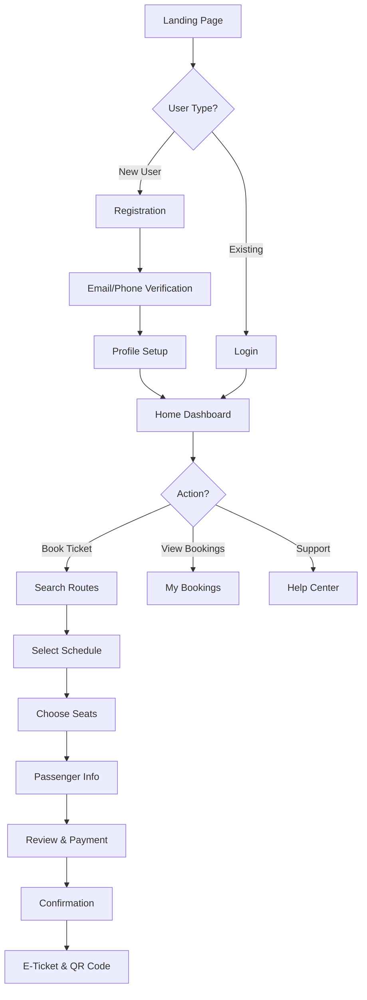
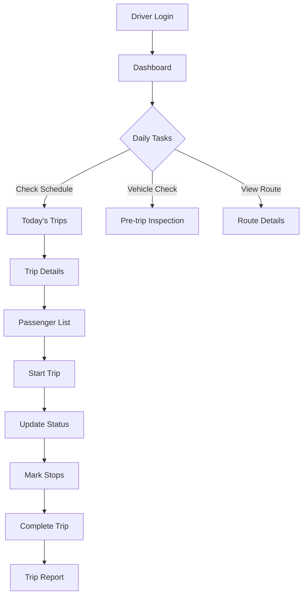
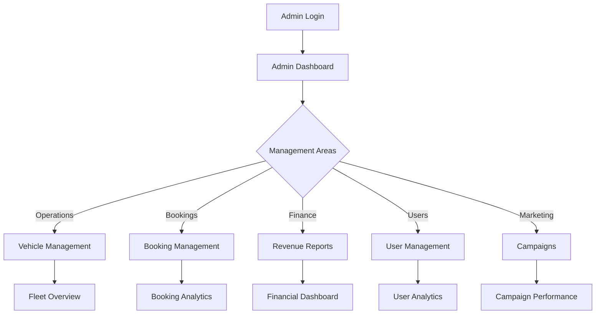

# Bus Booking System - UI/UX Design Document

## 1. Design System & Components Library

### 1.1 Design Principles
- **Simplicity First**: Tối giản, dễ hiểu cho mọi độ tuổi
- **Mobile-First**: Ưu tiên thiết kế cho mobile (70% users)  
- **Accessibility**: WCAG 2.1 AA compliance
- **Performance**: Loading time < 3s, smooth animations
- **Vietnamese UX**: Phù hợp thói quen người dùng Việt Nam

### 1.2 Color Palette

```scss
// Primary Colors
$primary-blue: #0066CC;      // Main CTA buttons
$primary-orange: #FF6B35;    // Accent & highlights
$primary-green: #00A86B;     // Success states

// Secondary Colors  
$secondary-dark: #2C3E50;    // Headers, main text
$secondary-gray: #7F8C8D;    // Secondary text
$secondary-light: #ECF0F1;   // Backgrounds

// Status Colors
$status-success: #27AE60;
$status-warning: #F39C12;
$status-danger: #E74C3C;
$status-info: #3498DB;

// Gradients
$gradient-primary: linear-gradient(135deg, #667EEA 0%, #764BA2 100%);
$gradient-sunset: linear-gradient(135deg, #FA709A 0%, #FEE140 100%);
```

### 1.3 Typography

```scss
// Font Family
$font-primary: 'Inter', -apple-system, BlinkMacSystemFont, 'Segoe UI', sans-serif;
$font-vietnamese: 'Be Vietnam Pro', sans-serif;

// Font Sizes
$text-xs: 12px;      // Captions, labels
$text-sm: 14px;      // Body small
$text-base: 16px;    // Body default
$text-lg: 18px;      // Subheadings
$text-xl: 24px;      // Headings
$text-2xl: 32px;     // Page titles
$text-3xl: 48px;     // Hero text
```

### 1.4 Component Library Structure

```
components/
├── atoms/
│   ├── Button/
│   ├── Input/
│   ├── Badge/
│   ├── Icon/
│   └── Spinner/
├── molecules/
│   ├── SearchBar/
│   ├── DatePicker/
│   ├── SeatSelector/
│   ├── PriceDisplay/
│   └── PaymentMethod/
├── organisms/
│   ├── Header/
│   ├── BookingForm/
│   ├── ScheduleCard/
│   ├── VehicleInfo/
│   └── UserProfile/
└── templates/
    ├── MainLayout/
    ├── AdminLayout/
    ├── MobileLayout/
    └── PrintLayout/
```

## 2. User Flows

### 2.1 Customer Journey Map



### 2.2 Driver Flow



### 2.3 Admin Flow



## 3. Page Layouts & Wireframes

### 3.1 Mobile App Screens

#### Home Screen
```
┌─────────────────────────┐
│   🔍 Search Bar         │
│   From: [Ho Chi Minh]   │
│   To: [Da Lat]          │
│   Date: [Tomorrow]      │
│   [Search Button]       │
├─────────────────────────┤
│   Quick Actions         │
│   ┌────┬────┬────┬────┐│
│   │ 🎫 │ 📅 │ 💰 │ ☎️ ││
│   │Book│Sche│Wall│Supp││
│   └────┴────┴────┴────┘│
├─────────────────────────┤
│   Popular Routes        │
│   ┌─────────────────┐   │
│   │ SGN → DLI       │   │
│   │ 6h • From 200k  │   │
│   └─────────────────┘   │
│   ┌─────────────────┐   │
│   │ SGN → NHA       │   │
│   │ 8h • From 250k  │   │
│   └─────────────────┘   │
├─────────────────────────┤
│   Bottom Navigation     │
│   [Home][Book][Ticket]  │
│   [Notif][Profile]      │
└─────────────────────────┘
```

#### Booking Flow - Seat Selection
```
┌─────────────────────────┐
│  ← Select Seats    ✓    │
├─────────────────────────┤
│   Vehicle: 45 seats     │
│   ┌─────────────────┐   │
│   │  Driver's Seat   │   │
│   ├─────────────────┤   │
│   │ [A1][A2] [A3][A4]│  │
│   │ [B1][B2] [B3][B4]│  │
│   │ [C1][C2] [C3][C4]│  │
│   │ [D1][D2] [D3][D4]│  │
│   │ [E1][E2] [E3][E4]│  │
│   └─────────────────┘   │
│                          │
│   Legend:                │
│   ⬜ Available           │
│   🟦 Selected            │
│   ⬛ Occupied            │
├─────────────────────────┤
│   Selected: A2, A3       │
│   Total: 400,000 VND    │
│   [Continue →]          │
└─────────────────────────┘
```

#### Payment Screen
```
┌─────────────────────────┐
│  ← Payment         3/4   │
├─────────────────────────┤
│   Booking Summary       │
│   ────────────────      │
│   Route: SGN → DLI      │
│   Date: 25/12/2024      │
│   Time: 07:00 AM        │
│   Seats: A2, A3         │
│   ────────────────      │
│   Subtotal: 400,000đ    │
│   Discount: -40,000đ    │
│   Total: 360,000đ       │
├─────────────────────────┤
│   Payment Method        │
│   ┌─────────────────┐   │
│   │ 💳 VNPay        │   │
│   └─────────────────┘   │
│   ┌─────────────────┐   │
│   │ 📱 Momo         │   │
│   └─────────────────┘   │
│   ┌─────────────────┐   │
│   │ 💰 Wallet       │   │
│   │ Balance: 500k   │   │
│   └─────────────────┘   │
├─────────────────────────┤
│   [Apply Coupon]        │
│   [Pay 360,000đ]        │
└─────────────────────────┘
```

### 3.2 Web Application Layouts

#### Landing Page Structure
```
┌────────────────────────────────────────────┐
│  Header                                    │
│  [Logo] [Routes] [Schedule] [About]        │
│  [Login] [Register]                        │
├────────────────────────────────────────────┤
│  Hero Section                              │
│  "Đặt vé xe khách dễ dàng"                 │
│  [Search Widget]                           │
│  • From • To • Date • Passengers           │
│  [Search Now]                              │
├────────────────────────────────────────────┤
│  Why Choose Us                             │
│  ┌──────┬──────┬──────┬──────┐           │
│  │ Safe │ Fast │Cheap │ 24/7 │            │
│  └──────┴──────┴──────┴──────┘           │
├────────────────────────────────────────────┤
│  Popular Routes Grid                       │
│  ┌──────────┐ ┌──────────┐ ┌──────────┐  │
│  │ Route 1  │ │ Route 2  │ │ Route 3  │  │
│  └──────────┘ └──────────┘ └──────────┘  │
├────────────────────────────────────────────┤
│  Footer                                    │
│  [Company] [Support] [Legal] [Contact]     │
└────────────────────────────────────────────┘
```

#### Admin Dashboard Layout
```
┌────────────────────────────────────────────┐
│  Admin Header                   [User Menu] │
├────────┬───────────────────────────────────┤
│        │  Dashboard Overview                │
│  Side  │  ┌─────────┬─────────┬─────────┐ │
│  Menu  │  │Revenue  │Bookings │Occupancy│ │
│        │  │2.5M VND │ 156     │ 78%     │ │
│  ----  │  └─────────┴─────────┴─────────┘ │
│        │                                    │
│  📊    │  Charts Area                      │
│  Dash  │  ┌────────────────────────────┐  │
│        │  │  Revenue Chart (Line)      │  │
│  🚌    │  └────────────────────────────┘  │
│  Fleet │  ┌────────────────────────────┐  │
│        │  │  Booking Heatmap           │  │
│  🎫    │  └────────────────────────────┘  │
│  Book  │                                    │
│        │  Recent Activities Table          │
│  👥    │  ┌────────────────────────────┐  │
│  Users │  │ Time  | Action  | User     │  │
│        │  │ 10:30 | Booked  | Nguyen   │  │
│  💰    │  │ 10:25 | Cancel  | Tran     │  │
│  Finance│ └────────────────────────────┘  │
└────────┴───────────────────────────────────┘
```

## 4. Component Specifications

### 4.1 Search Widget Component

```tsx
interface SearchWidgetProps {
  defaultOrigin?: string;
  defaultDestination?: string;
  onSearch: (params: SearchParams) => void;
}

const SearchWidget: React.FC<SearchWidgetProps> = () => {
  return (
    <div className="search-widget">
      <AutoComplete
        placeholder="From"
        options={stations}
        icon={<LocationIcon />}
      />
      <SwapButton onClick={swapLocations} />
      <AutoComplete
        placeholder="To"
        options={stations}
        icon={<LocationIcon />}
      />
      <DatePicker
        placeholder="Departure Date"
        minDate={today}
        maxDate={threeMonthsLater}
      />
      <PassengerSelector
        defaultValue={1}
        max={10}
      />
      <Button
        variant="primary"
        size="large"
        onClick={handleSearch}
      >
        Search Routes
      </Button>
    </div>
  );
};
```

### 4.2 Schedule Card Component

```tsx
interface ScheduleCardProps {
  schedule: Schedule;
  onSelect: (id: string) => void;
  isSelected?: boolean;
}

const ScheduleCard: React.FC<ScheduleCardProps> = ({ schedule }) => {
  return (
    <Card className={`schedule-card ${isSelected ? 'selected' : ''}`}>
      <div className="time-route">
        <div className="departure">
          <span className="time">{schedule.departureTime}</span>
          <span className="station">{schedule.origin}</span>
        </div>
        <div className="duration">
          <span>{schedule.duration}</span>
          <ArrowIcon />
        </div>
        <div className="arrival">
          <span className="time">{schedule.arrivalTime}</span>
          <span className="station">{schedule.destination}</span>
        </div>
      </div>
      
      <div className="vehicle-info">
        <Badge>{schedule.vehicleType}</Badge>
        <span className="seats">{schedule.availableSeats} seats left</span>
      </div>
      
      <div className="price-section">
        <Price amount={schedule.price} currency="VND" />
        <Button onClick={() => onSelect(schedule.id)}>
          Select
        </Button>
      </div>
    </Card>
  );
};
```

### 4.3 Seat Selector Component

```tsx
interface SeatSelectorProps {
  layout: SeatLayout;
  occupied: string[];
  selected: string[];
  onSelect: (seatId: string) => void;
  maxSelection?: number;
}

const SeatSelector: React.FC<SeatSelectorProps> = () => {
  return (
    <div className="seat-selector">
      <div className="bus-layout">
        <div className="driver-cabin">
          <DriverIcon />
        </div>
        
        <div className="seats-grid">
          {layout.rows.map((row, rowIndex) => (
            <div key={rowIndex} className="seat-row">
              {row.seats.map((seat) => (
                <Seat
                  key={seat.id}
                  id={seat.id}
                  type={seat.type}
                  status={getSeatStatus(seat.id)}
                  onClick={() => handleSeatClick(seat.id)}
                />
              ))}
            </div>
          ))}
        </div>
      </div>
      
      <SeatLegend />
      
      <div className="selection-summary">
        <span>Selected: {selected.join(', ')}</span>
        <Price amount={calculatePrice(selected)} />
      </div>
    </div>
  );
};
```

## 5. Mobile-Specific Features

### 5.1 Touch Gestures
- **Swipe left/right**: Navigate between booking steps
- **Pull to refresh**: Update schedule list
- **Pinch to zoom**: View seat layout details
- **Long press**: Quick actions on bookings

### 5.2 Native Features Integration
```javascript
// GPS Location for nearby stations
navigator.geolocation.getCurrentPosition((position) => {
  findNearbyStations(position.coords);
});

// Camera for QR code scanning
const qrScanner = new QRScanner();
qrScanner.scan().then((result) => {
  validateTicket(result.data);
});

// Push Notifications
Firebase.messaging().onMessage((payload) => {
  showNotification({
    title: payload.notification.title,
    body: payload.notification.body,
    icon: '/icons/bus-icon.png'
  });
});

// Share ticket
if (navigator.share) {
  navigator.share({
    title: 'My Bus Ticket',
    text: `Booking ${bookingCode}`,
    url: ticketUrl
  });
}
```

## 6. Responsive Breakpoints

```scss
// Breakpoint variables
$breakpoint-xs: 320px;   // Small phones
$breakpoint-sm: 576px;   // Phones
$breakpoint-md: 768px;   // Tablets
$breakpoint-lg: 992px;   // Desktop
$breakpoint-xl: 1200px;  // Large desktop
$breakpoint-xxl: 1400px; // Extra large

// Media queries
@mixin responsive($breakpoint) {
  @if $breakpoint == 'phone' {
    @media (max-width: $breakpoint-sm) { @content; }
  }
  @else if $breakpoint == 'tablet' {
    @media (min-width: $breakpoint-md) and (max-width: $breakpoint-lg) { @content; }
  }
  @else if $breakpoint == 'desktop' {
    @media (min-width: $breakpoint-lg) { @content; }
  }
}

// Usage example
.search-widget {
  padding: 2rem;
  
  @include responsive('phone') {
    padding: 1rem;
    flex-direction: column;
  }
  
  @include responsive('tablet') {
    padding: 1.5rem;
  }
}
```

## 7. Accessibility Features

### 7.1 ARIA Labels & Roles
```html
<!-- Search Form -->
<form role="search" aria-label="Search for bus routes">
  <label for="origin" class="sr-only">Departure location</label>
  <input 
    id="origin"
    type="text"
    aria-label="From"
    aria-required="true"
    aria-autocomplete="list"
  />
  
  <button 
    aria-label="Swap departure and arrival locations"
    type="button"
  >
    <SwapIcon aria-hidden="true" />
  </button>
</form>

<!-- Seat Selection -->
<div role="group" aria-label="Select your seats">
  <button
    role="checkbox"
    aria-checked={isSelected}
    aria-label={`Seat ${seatNumber}, ${seatStatus}`}
    aria-describedby="seat-price"
  >
    {seatNumber}
  </button>
</div>

<!-- Loading States -->
<div 
  role="status"
  aria-live="polite"
  aria-busy={isLoading}
>
  <span class="sr-only">Loading schedules...</span>
</div>
```

### 7.2 Keyboard Navigation
```javascript
// Keyboard shortcuts
const keyboardShortcuts = {
  'Ctrl+/': 'Open help',
  'Ctrl+K': 'Focus search',
  'Escape': 'Close modal',
  'Tab': 'Next field',
  'Shift+Tab': 'Previous field',
  'Enter': 'Submit/Select',
  'Space': 'Toggle selection',
  'Arrow Keys': 'Navigate seats'
};

// Implementation
document.addEventListener('keydown', (e) => {
  if (e.ctrlKey && e.key === 'k') {
    e.preventDefault();
    searchInput.focus();
  }
  
  if (e.key === 'Escape' && modalOpen) {
    closeModal();
  }
});
```

## 8. Performance Optimization

### 8.1 Loading Strategies
```typescript
// Lazy loading routes
const BookingPage = lazy(() => import('./pages/Booking'));
const AdminDashboard = lazy(() => import('./pages/Admin/Dashboard'));

// Image optimization
<Image
  src="/images/bus.jpg"
  loading="lazy"
  srcSet="/images/bus-320w.jpg 320w,
          /images/bus-768w.jpg 768w,
          /images/bus-1024w.jpg 1024w"
  sizes="(max-width: 320px) 280px,
         (max-width: 768px) 720px,
         1024px"
  alt="Modern bus interior"
/>

// Skeleton loading
const ScheduleSkeleton = () => (
  <div className="skeleton-card">
    <div className="skeleton-line skeleton-time"></div>
    <div className="skeleton-line skeleton-route"></div>
    <div className="skeleton-line skeleton-price"></div>
  </div>
);
```

### 8.2 Caching Strategy
```javascript
// Service Worker for offline support
self.addEventListener('install', (event) => {
  event.waitUntil(
    caches.open('v1').then((cache) => {
      return cache.addAll([
        '/',
        '/styles/main.css',
        '/scripts/app.js',
        '/offline.html'
      ]);
    })
  );
});

// Local storage for user preferences
const UserPreferences = {
  save: (prefs) => {
    localStorage.setItem('userPrefs', JSON.stringify(prefs));
  },
  load: () => {
    return JSON.parse(localStorage.getItem('userPrefs') || '{}');
  }
};

// IndexedDB for offline bookings
const offlineBookings = {
  save: async (booking) => {
    const db = await openDB('BookingDB', 1);
    await db.add('pending', booking);
  },
  sync: async () => {
    const db = await openDB('BookingDB', 1);
    const pending = await db.getAll('pending');
    // Sync when online
  }
};
```

## 9. Animation & Micro-interactions

### 9.1 CSS Animations
```scss
// Button hover effect
.btn-primary {
  transition: all 0.3s cubic-bezier(0.4, 0, 0.2, 1);
  
  &:hover {
    transform: translateY(-2px);
    box-shadow: 0 10px 20px rgba(0, 102, 204, 0.3);
  }
  
  &:active {
    transform: translateY(0);
  }
}

// Seat selection animation
@keyframes seatPulse {
  0% { transform: scale(1); }
  50% { transform: scale(1.1); }
  100% { transform: scale(1); }
}

.seat-selected {
  animation: seatPulse 0.3s ease-in-out;
  background-color: $primary-blue;
}

// Loading spinner
@keyframes spin {
  to { transform: rotate(360deg); }
}

.spinner {
  animation: spin 1s linear infinite;
}

// Page transitions
.page-enter {
  opacity: 0;
  transform: translateX(100%);
}

.page-enter-active {
  opacity: 1;
  transform: translateX(0);
  transition: opacity 300ms, transform 300ms;
}
```

### 9.2 React Spring Animations
```typescript
import { useSpring, animated, useTrail } from 'react-spring';

// Fade in animation
const fadeIn = useSpring({
  from: { opacity: 0, transform: 'translateY(20px)' },
  to: { opacity: 1, transform: 'translateY(0px)' },
  config: { tension: 200, friction: 20 }
});

// Stagger animation for list items
const trail = useTrail(schedules.length, {
  from: { opacity: 0, x: -20 },
  to: { opacity: 1, x: 0 },
  delay: 200
});

// Number counter animation
const Counter = ({ value }) => {
  const props = useSpring({
    number: value,
    from: { number: 0 },
    config: { duration: 1000 }
  });
  
  return (
    <animated.span>
      {props.number.to(n => n.toFixed(0))}
    </animated.span>
  );
};
```

## 10. Error States & Empty States

### 10.1 Error Handling UI
```tsx
const ErrorState = ({ error, onRetry }) => (
  <div className="error-state">
    
    <h3>Oops! Something went wrong</h3>
    <p>{error.message || 'Please try again later'}</p>
    <Button onClick={onRetry}>
      <RefreshIcon /> Try Again
    </Button>
  </div>
);

const NoResultsState = ({ searchTerm }) => (
  <div className="empty-state">
    
    <h3>No routes found</h3>
    <p>We couldn't find any routes for "{searchTerm}"</p>
    <Button variant="secondary" onClick={clearSearch}>
      Clear Search
    </Button>
  </div>
);

const OfflineState = () => (
  <div className="offline-state">
    <WifiOffIcon size={48} />
    <h3>You're offline</h3>
    <p>Check your internet connection and try again</p>
  </div>
);
```

## 11. Notification System

### 11.1 Toast Notifications
```tsx
const toastConfig = {
  success: {
    icon: <CheckCircleIcon />,
    duration: 3000,
    className: 'toast-success'
  },
  error: {
    icon: <XCircleIcon />,
    duration: 5000,
    className: 'toast-error'
  },
  warning: {
    icon: <AlertIcon />,
    duration: 4000,
    className: 'toast-warning'
  },
  info: {
    icon: <InfoIcon />,
    duration: 3000,
    className: 'toast-info'
  }
};

// Usage
toast.success('Booking confirmed! Check your email for details.');
toast.error('Payment failed. Please try again.');
toast.warning('Only 2 seats left for this schedule.');
toast.info('New routes added to Da Lat!');
```

### 11.2 Push Notification Templates
```javascript
const notificationTemplates = {
  bookingConfirmed: {
    title: 'Booking Confirmed! 🎉',
    body: 'Your trip to {destination} on {date} is confirmed.',
    icon: '/icons/success.png',
    badge: '/icons/badge.png',
    actions: [
      { action: 'view', title: 'View Ticket' },
      { action: 'share', title: 'Share' }
    ]
  },
  
  departureReminder: {
    title: 'Trip Reminder 🚌',
    body: 'Your bus departs in {time} from {station}',
    icon: '/icons/bus.png',
    requireInteraction: true,
    actions: [
      { action: 'directions', title: 'Get Directions' },
      { action: 'ticket', title: 'View Ticket' }
    ]
  },
  
  promotionalOffer: {
    title: 'Special Offer! 🎁',
    body: 'Get {discount}% off on {route} routes',
    icon: '/icons/promo.png',
    image: '/images/promo-banner.jpg',
    actions: [
      { action: 'book', title: 'Book Now' },
      { action: 'later', title: 'Maybe Later' }
    ]
  }
};
```

## 12. Dark Mode Support

```scss
// CSS Variables for theming
:root {
  --color-bg: #ffffff;
  --color-text: #2c3e50;
  --color-primary: #0066cc;
  --color-secondary: #7f8c8d;
  --color-border: #e1e4e8;
  --color-card: #ffffff;
  --shadow-sm: 0 1px 3px rgba(0,0,0,0.12);
  --shadow-md: 0 4px 6px rgba(0,0,0,0.1);
}

[data-theme="dark"] {
  --color-bg: #1a1a1a;
  --color-text: #e1e4e8;
  --color-primary: #4dabf7;
  --color-secondary: #adb5bd;
  --color-border: #2d3748;
  --color-card: #2d3748;
  --shadow-sm: 0 1px 3px rgba(0,0,0,0.5);
  --shadow-md: 0 4px 6px rgba(0,0,0,0.3);
}

// React Theme Toggle
const ThemeToggle = () => {
  const [theme, setTheme] = useState('light');
  
  useEffect(() => {
    document.documentElement.setAttribute('data-theme', theme);
    localStorage.setItem('theme', theme);
  }, [theme]);
  
  return (
    <button
      onClick={() => setTheme(theme === 'light' ? 'dark' : 'light')}
      aria-label="Toggle theme"
    >
      {theme === 'light' ? <MoonIcon /> : <SunIcon />}
    </button>
  );
};
```

## 13. Testing & Quality Assurance

### 13.1 Component Testing
```typescript
// Unit test for SearchWidget
describe('SearchWidget', () => {
  it('should validate required fields', () => {
    const { getByText, getByLabelText } = render(<SearchWidget />);
    const searchButton = getByText('Search Routes');
    
    fireEvent.click(searchButton);
    
    expect(getByText('Please select origin')).toBeInTheDocument();
    expect(getByText('Please select destination')).toBeInTheDocument();
  });
  
  it('should swap locations when swap button clicked', () => {
    const { getByLabelText } = render(<SearchWidget />);
    const originInput = getByLabelText('From');
    const destInput = getByLabelText('To');
    const swapButton = getByLabelText('Swap locations');
    
    fireEvent.change(originInput, { target: { value: 'Ho Chi Minh' } });
    fireEvent.change(destInput, { target: { value: 'Da Lat' } });
    fireEvent.click(swapButton);
    
    expect(originInput.value).toBe('Da Lat');
    expect(destInput.value).toBe('Ho Chi Minh');
  });
});
```

### 13.2 E2E Testing with Cypress
```javascript
// Booking flow E2E test
describe('Booking Flow', () => {
  it('should complete a booking successfully', () => {
    cy.visit('/');
    
    // Search for routes
    cy.get('[data-testid="origin-input"]').type('Ho Chi Minh');
    cy.get('[data-testid="destination-input"]').type('Da Lat');
    cy.get('[data-testid="date-picker"]').click();
    cy.get('.date-picker-day').contains('25').click();
    cy.get('[data-testid="search-button"]').click();
    
    // Select schedule
    cy.get('.schedule-card').first().click();
    
    // Select seats
    cy.get('[data-testid="seat-A2"]').click();
    cy.get('[data-testid="seat-A3"]').click();
    cy.get('[data-testid="continue-button"]').click();
    
    // Fill passenger info
    cy.get('[name="passenger1.name"]').type('Nguyen Van A');
    cy.get('[name="passenger1.id"]').type('123456789');
    cy.get('[name="passenger2.name"]').type('Tran Thi B');
    cy.get('[name="passenger2.id"]').type('987654321');
    cy.get('[data-testid="continue-button"]').click();
    
    // Complete payment
    cy.get('[data-testid="payment-vnpay"]').click();
    cy.get('[data-testid="pay-button"]').click();
    
    // Verify confirmation
    cy.url().should('include', '/booking/confirmation');
    cy.get('.booking-code').should('be.visible');
    cy.get('.qr-code').should('be.visible');
  });
});
```
