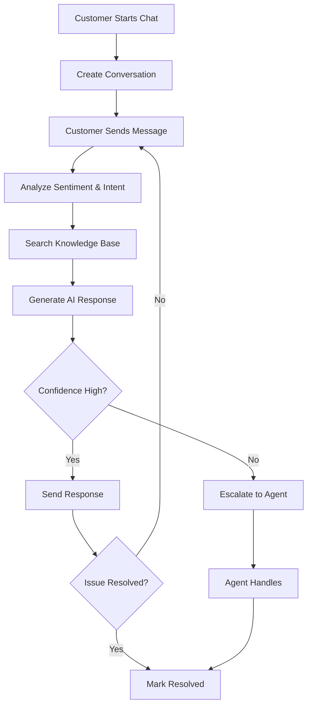
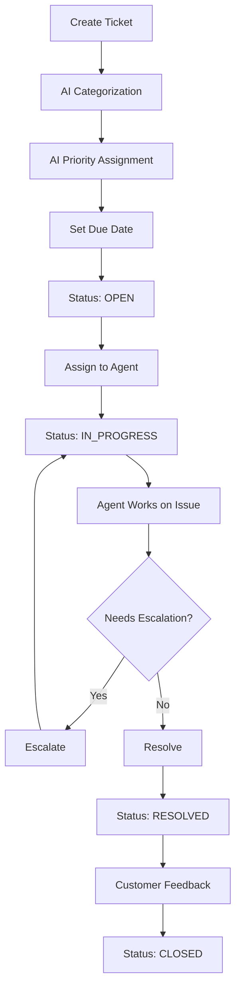

# AI Support Service

An intelligent customer support service powered by OpenAI, providing automated chat assistance, ticket management, and comprehensive analytics for the Big Bus platform.

## Features

- **AI-Powered Chat**: Real-time customer support with GPT-4 integration
- **Intelligent Ticket Management**: Auto-categorization, prioritization, and routing
- **Sentiment Analysis**: Real-time sentiment tracking for conversations
- **Intent Detection**: Automatic understanding of customer needs
- **Knowledge Base Integration**: AI references internal documentation
- **Analytics & Insights**: Comprehensive metrics and performance tracking
- **Multi-channel Support**: Web chat, email, phone, mobile app, WhatsApp
- **Agent Dashboard**: Tools for human agents to manage escalated cases

## Architecture

### Entities

#### Conversation
- **Chat Management**: Real-time conversations with customers
- **Multi-channel**: Web, mobile, email, phone, WhatsApp support
- **Status Tracking**: Active, resolved, escalated, closed
- **Metrics**: Response time, resolution time, message counts
- **Sentiment Analysis**: Automatic sentiment scoring
- **Agent Assignment**: Escalation to human agents when needed

#### Message
- **Message Types**: Text, image, file, audio, video, links, cards
- **Role Support**: User, assistant (AI), system, agent (human)
- **AI Metadata**: Model used, tokens consumed, confidence scores
- **Sentiment & Intent**: Automatic analysis for each message
- **Entity Extraction**: Key information extraction (dates, IDs, amounts)

#### Ticket
- **Support Tickets**: Structured issue tracking
- **Auto-categorization**: AI-powered category and priority assignment
- **Status Workflow**: Open → In Progress → Resolved → Closed
- **Priority Levels**: Low, Medium, High, Urgent, Critical
- **SLA Management**: Automatic due dates based on priority
- **History Tracking**: Complete audit trail of all changes

#### Knowledge Base
- **Article Management**: Internal documentation for AI reference
- **Categories**: FAQ, Troubleshooting, How-to, Policies
- **Analytics**: Track article usage and helpfulness
- **AI Integration**: Automatic article reference in responses

## API Endpoints

### Chat API

#### Create Conversation
```bash
POST /api/v1/chat/conversations
Content-Type: application/json

{
  "customerId": "customer_123",
  "customerName": "John Doe",
  "customerEmail": "john@example.com",
  "channel": "web_chat",
  "subject": "Booking inquiry"
}
```

#### Send Message (Get AI Response)
```bash
POST /api/v1/chat/conversations/:id/messages
Content-Type: application/json

{
  "content": "I need help with my booking",
  "userId": "customer_123",
  "userName": "John Doe"
}

Response:
{
  "message": {
    "id": "msg_123",
    "role": "user",
    "content": "I need help with my booking",
    "sentiment": "neutral",
    "intent": "booking_inquiry"
  },
  "aiResponse": {
    "id": "msg_124",
    "role": "assistant",
    "content": "I'd be happy to help you with your booking. Could you please provide your booking ID?",
    "isAiGenerated": true,
    "aiModel": "gpt-4-turbo-preview",
    "confidenceScore": 0.85
  }
}
```

#### Get Conversation Messages
```bash
GET /api/v1/chat/conversations/:id/messages
```

#### List Conversations
```bash
GET /api/v1/chat/conversations?customerId=customer_123&status=active
GET /api/v1/chat/conversations?assignedAgentId=agent_456&page=1&limit=20
```

#### Assign to Human Agent
```bash
PATCH /api/v1/chat/conversations/:id/assign
Content-Type: application/json

{
  "agentId": "agent_456",
  "agentName": "Sarah Smith"
}
```

#### Resolve Conversation
```bash
PATCH /api/v1/chat/conversations/:id/resolve
```

#### Rate Conversation
```bash
POST /api/v1/chat/conversations/:id/rate
Content-Type: application/json

{
  "rating": 5,
  "feedback": "Very helpful and quick response!"
}
```

#### Get Conversation Statistics
```bash
GET /api/v1/chat/stats?startDate=2025-01-01&endDate=2025-01-31

Response:
{
  "totalConversations": 1500,
  "byStatus": {
    "active": 50,
    "resolved": 1200,
    "escalated": 150,
    "closed": 100
  },
  "bySentiment": {
    "positive": 800,
    "neutral": 500,
    "negative": 200
  },
  "averageResponseTime": 45,
  "averageResolutionTime": 300,
  "averageSatisfactionRating": 4.5,
  "aiHandledPercentage": 75
}
```

### Tickets API

#### Create Ticket
```bash
POST /api/v1/tickets
Content-Type: application/json

{
  "customerId": "customer_123",
  "customerName": "John Doe",
  "customerEmail": "john@example.com",
  "subject": "Refund request for cancelled booking",
  "description": "I cancelled my booking but haven't received my refund yet",
  "category": "refund",
  "priority": "high",
  "source": "email",
  "relatedBookingId": "booking_789"
}

Response:
{
  "id": "ticket_123",
  "ticketNumber": "TKT-ABC123",
  "status": "open",
  "priority": "high",
  "category": "refund",
  "aiSuggestedCategory": "refund",
  "aiSuggestedPriority": "high",
  "aiSuggestedResponse": "I understand your concern about the refund...",
  "dueDate": "2025-01-16T10:00:00Z"
}
```

#### List Tickets
```bash
GET /api/v1/tickets?status=open&priority=high
GET /api/v1/tickets?customerId=customer_123&page=1&limit=20
GET /api/v1/tickets?assignedAgentId=agent_456&category=refund
```

#### Get Ticket
```bash
GET /api/v1/tickets/:id
GET /api/v1/tickets/number/:ticketNumber
```

#### Update Ticket
```bash
PATCH /api/v1/tickets/:id
Content-Type: application/json

{
  "status": "in_progress",
  "priority": "urgent",
  "assignedAgentId": "agent_456"
}
```

#### Assign Ticket
```bash
POST /api/v1/tickets/assign
Content-Type: application/json

{
  "ticketId": "ticket_123",
  "agentId": "agent_456",
  "agentName": "Sarah Smith",
  "team": "refunds"
}
```

#### Resolve Ticket
```bash
POST /api/v1/tickets/resolve
Content-Type: application/json

{
  "ticketId": "ticket_123",
  "resolution": "Refund has been processed successfully. Amount will reflect in 3-5 business days.",
  "agentId": "agent_456"
}
```

#### Escalate Ticket
```bash
POST /api/v1/tickets/escalate
Content-Type: application/json

{
  "ticketId": "ticket_123",
  "reason": "Customer is very upset, requires manager attention",
  "escalatedTo": "manager_team"
}
```

#### Get Ticket Statistics
```bash
GET /api/v1/tickets/stats?startDate=2025-01-01&endDate=2025-01-31

Response:
{
  "totalTickets": 500,
  "byStatus": {
    "open": 50,
    "in_progress": 100,
    "resolved": 300,
    "closed": 50
  },
  "byPriority": {
    "low": 100,
    "medium": 200,
    "high": 150,
    "urgent": 40,
    "critical": 10
  },
  "averageResponseTime": 120,
  "averageResolutionTime": 3600,
  "averageSatisfactionRating": 4.2,
  "escalationRate": 15
}
```

### Analytics API

#### Get Dashboard Metrics
```bash
GET /api/v1/analytics/dashboard?startDate=2025-01-01&endDate=2025-01-31

Response:
{
  "overview": {
    "totalConversations": 1500,
    "totalTickets": 500,
    "totalMessages": 5000,
    "aiMessagesCount": 2500,
    "aiMessagesPercentage": 50
  },
  "performance": {
    "averageResponseTime": 60,
    "averageResolutionTime": 1800,
    "customerSatisfaction": 4.3
  },
  "sentiment": {
    "positive": 800,
    "neutral": 500,
    "negative": 200
  },
  "trends": {
    "conversations": [...],
    "tickets": [...],
    "messages": [...]
  }
}
```

#### Get Agent Performance
```bash
GET /api/v1/analytics/agent/:agentId?startDate=2025-01-01&endDate=2025-01-31

Response:
{
  "agentId": "agent_456",
  "totalConversations": 150,
  "totalTickets": 75,
  "resolvedConversations": 140,
  "resolvedTickets": 70,
  "averageResponseTime": 45,
  "averageResolutionTime": 600,
  "customerSatisfaction": 4.7,
  "resolutionRate": 93.3
}
```

#### Get Top Issues
```bash
GET /api/v1/analytics/top-issues?limit=10

Response:
[
  {
    "category": "booking",
    "count": 150,
    "resolved": 140,
    "averageResolutionTime": 300,
    "resolutionRate": 93.3
  },
  {
    "category": "refund",
    "count": 100,
    "resolved": 90,
    "averageResolutionTime": 1200,
    "resolutionRate": 90
  }
]
```

#### Get AI Insights
```bash
GET /api/v1/analytics/ai-insights?startDate=2025-01-01&endDate=2025-01-31

Response:
{
  "totalAIMessages": 2500,
  "totalTokensUsed": 500000,
  "averageConfidence": 0.82,
  "aiCategoryAccuracy": 95,
  "topIntents": [
    { "intent": "booking_inquiry", "count": 500 },
    { "intent": "payment_issue", "count": 300 }
  ],
  "sentimentDistribution": {
    "positive": 1200,
    "neutral": 800,
    "negative": 500
  }
}
```

## AI Capabilities

### GPT-4 Integration

The service uses OpenAI's GPT-4 for:

1. **Conversational Responses**: Natural, helpful customer support conversations
2. **Sentiment Analysis**: Real-time emotional tone detection
3. **Intent Detection**: Understanding customer needs and goals
4. **Ticket Categorization**: Auto-categorizing and prioritizing tickets
5. **Entity Extraction**: Identifying key information (dates, IDs, amounts)
6. **Conversation Summarization**: Automatic summaries for resolved conversations

### Knowledge Base Integration

- AI automatically searches knowledge base for relevant articles
- Articles are referenced in responses to provide accurate information
- Usage tracking helps identify most helpful articles
- Continuous improvement through feedback loops

### Confidence Scoring

- Each AI response includes a confidence score (0-1)
- Low confidence triggers automatic escalation to human agents
- Helps maintain high quality customer experience

## Workflows

### Customer Chat Flow



### Ticket Lifecycle



## Configuration

### Environment Variables

```env
# Server
PORT=3009
NODE_ENV=development

# Database
DB_HOST=localhost
DB_PORT=5432
DB_USERNAME=postgres
DB_PASSWORD=postgres
DB_DATABASE=ai_support_db

# OpenAI
OPENAI_API_KEY=your_openai_api_key_here
OPENAI_MODEL=gpt-4-turbo-preview

# CORS
CORS_ORIGIN=http://localhost:3000
```

### OpenAI Models

- **gpt-4-turbo-preview**: Primary model for complex conversations (default)
- **gpt-3.5-turbo**: Used for sentiment analysis and intent detection (faster, cheaper)

## Integration with Other Services

### Booking Service
```typescript
// Link conversations/tickets to bookings
const conversation = await chatService.createConversation({
  customerId: customer.id,
  metadata: {
    relatedBookingId: booking.id,
    routeId: booking.routeId
  }
});
```

### Payment Service
```typescript
// Handle payment-related tickets
const ticket = await ticketsService.create({
  category: 'payment',
  relatedPaymentId: payment.id,
  description: 'Payment failed but amount was deducted'
});
```

### Marketplace Service
```typescript
// Support for marketplace orders
const ticket = await ticketsService.create({
  category: 'marketplace',
  relatedOrderId: order.id,
  description: 'Product not received'
});
```

## Database Schema

### Conversation Entity
- `id`: UUID
- `customerId`, `sessionId`: Customer identification
- `channel`: Web, mobile, email, phone, WhatsApp
- `status`: Active, resolved, escalated, closed
- `sentiment`, `sentimentScore`: Emotional analysis
- `messageCount`, `aiMessageCount`, `humanMessageCount`: Metrics
- `responseTimeSeconds`, `resolutionTimeSeconds`: Performance
- `customerSatisfactionRating`, `customerFeedback`: Quality metrics

### Message Entity
- `id`: UUID
- `conversationId`: Link to conversation
- `role`: User, assistant, system, agent
- `content`, `type`: Message data
- `isAiGenerated`, `aiModel`, `aiTokensUsed`: AI metadata
- `sentiment`, `intent`, `entities`: Analysis results
- `confidenceScore`: AI confidence level

### Ticket Entity
- `id`: UUID
- `ticketNumber`: Unique identifier (TKT-XXX)
- `category`: Booking, payment, refund, etc.
- `priority`: Low to Critical
- `status`: Open to Closed workflow
- `aiSuggestedCategory`, `aiSuggestedResponse`: AI insights
- `dueDate`: SLA management
- `history`: Complete audit trail

## Running the Service

### Development
```bash
cd services/ai-support
pnpm install
pnpm run dev
```

### Production
```bash
pnpm run build
pnpm run start:prod
```

### Docker
```bash
docker-compose up ai-support-service
```

## Monitoring & Analytics

### Key Metrics

- **Response Time**: Average time to first response
- **Resolution Time**: Average time to resolve issues
- **Customer Satisfaction**: Average rating (1-5)
- **AI Automation Rate**: % of conversations handled entirely by AI
- **Escalation Rate**: % of conversations/tickets escalated to humans
- **Sentiment Trends**: Tracking customer sentiment over time

### Alerts

- High volume of negative sentiment conversations
- SLA breaches (tickets past due date)
- Low AI confidence scores requiring review
- Sudden spike in ticket volume by category

## Best Practices

### AI Response Quality
- Regularly review AI responses for accuracy
- Update knowledge base with new information
- Monitor confidence scores and escalate when low
- Collect customer feedback to improve prompts

### Agent Workflow
- Prioritize high-priority and escalated tickets
- Review AI suggestions before manual categorization
- Add internal notes for complex cases
- Update ticket status promptly

### Customer Experience
- Set clear expectations for response times
- Provide option to escalate to human agent
- Follow up on resolved tickets
- Use satisfaction ratings to improve service

## Future Enhancements

- [ ] Voice support integration
- [ ] Multi-language support
- [ ] Automated callback scheduling
- [ ] Integration with CRM systems
- [ ] Advanced analytics dashboards
- [ ] Chatbot training interface
- [ ] Custom AI model fine-tuning
- [ ] Proactive outreach based on patterns
- [ ] Integration with social media channels
- [ ] Video call support

## License

MIT
