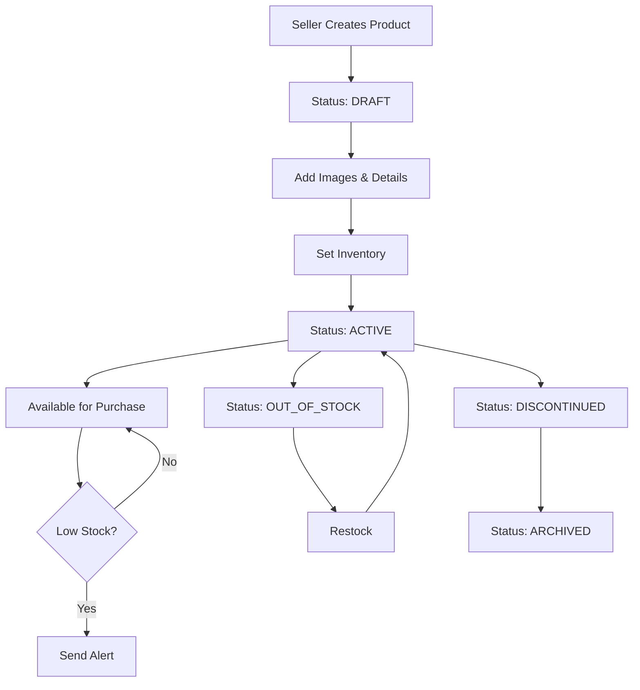
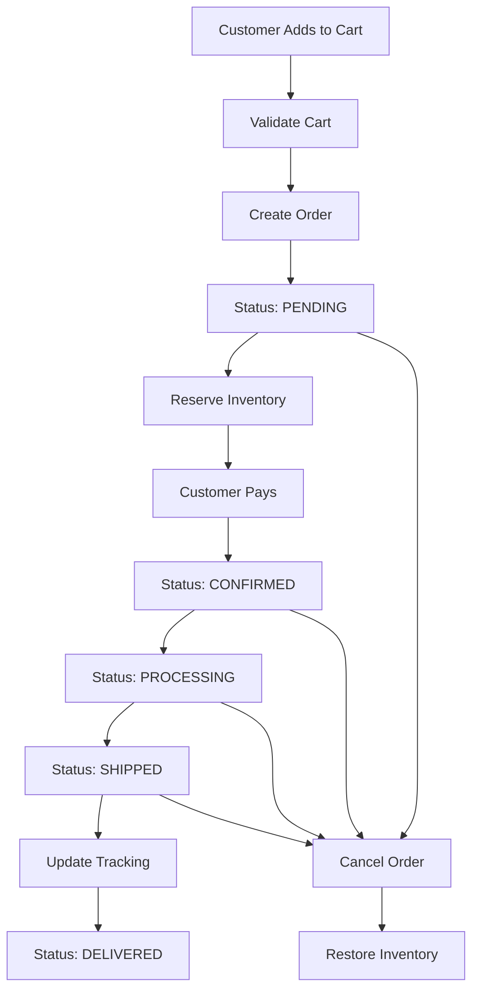
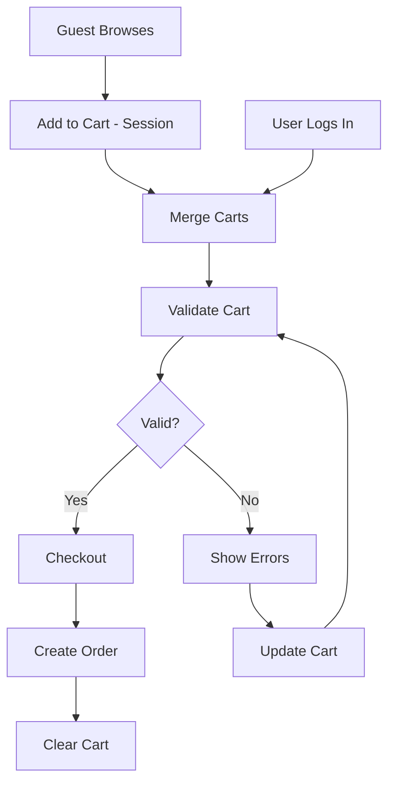

# Marketplace Service

A comprehensive e-commerce marketplace service for the Big Bus platform, enabling sellers to offer products and services to bus passengers during their journey.

## Features

- **Product Management**: Full CRUD operations for products with variants, inventory tracking, and categories
- **Order Management**: Complete order lifecycle from creation to delivery with status tracking
- **Shopping Cart**: Guest and authenticated user cart support with session management
- **Inventory System**: Real-time inventory tracking with operation logging
- **Multi-delivery Methods**: Support for delivery, pickup, and on-bus delivery
- **Bus-specific Products**: Products can be marked as available on specific routes
- **Search and Filtering**: Advanced product search with multiple filter options
- **Order Statistics**: Revenue tracking and order analytics

## Architecture

### Entities

#### Product
- **Product Details**: Name, description, type, category, pricing
- **Variants**: Multiple SKUs with different attributes (size, color, etc.)
- **Inventory**: Quantity tracking with low stock alerts
- **Images**: Multiple product images support
- **Bus Integration**: Route-specific availability
- **SEO**: Title and description for search optimization
- **Rating**: Customer ratings and review counts

#### Order
- **Order Information**: Order number, items, totals (subtotal, tax, shipping)
- **Customer Details**: Customer ID and contact information
- **Addresses**: Separate shipping and billing addresses
- **Status Tracking**: Pending → Confirmed → Processing → Shipped → Delivered
- **Payment Integration**: Payment status and intent tracking
- **Delivery Options**: Delivery, pickup, or on-bus delivery
- **Tracking**: Shipping tracking number and URL
- **Timestamps**: Created, confirmed, shipped, delivered, paid dates

#### Cart
- **User Association**: Support for both authenticated users and guest sessions
- **Items**: Products with quantities, prices, and variants
- **Totals**: Subtotal and total calculations
- **Session Management**: Automatic cart merging when guest logs in

#### InventoryLog
- **Operations**: Purchase, return, adjustment, damage, restock, reserved, cancelled
- **Audit Trail**: Complete history of inventory changes
- **Tracking**: Quantity before/after, change amount, and reason

## API Endpoints

### Products API

#### Create Product
```bash
POST /products
Content-Type: application/json

{
  "sellerId": "seller_123",
  "name": "Travel Pillow",
  "description": "Comfortable memory foam travel pillow",
  "type": "physical",
  "category": "travel-accessories",
  "subcategory": "comfort",
  "price": 24.99,
  "currency": "USD",
  "images": ["https://example.com/image1.jpg"],
  "variants": [
    {
      "name": "Blue",
      "sku": "TP-BLUE",
      "price": 24.99,
      "inventory": 50,
      "attributes": { "color": "blue" }
    }
  ],
  "inventory": {
    "quantity": 100,
    "trackInventory": true,
    "lowStockThreshold": 10
  },
  "tags": ["travel", "comfort", "sleep"],
  "isAvailableOnBus": true,
  "availableRoutes": ["route_1", "route_2"],
  "seoTitle": "Premium Travel Pillow - Comfortable Sleep",
  "seoDescription": "Memory foam travel pillow for comfortable journeys"
}
```

#### List Products
```bash
GET /products?category=travel-accessories&page=1&limit=20
GET /products?sellerId=seller_123&status=active
GET /products?isAvailableOnBus=true&search=pillow
GET /products?minPrice=10&maxPrice=50&tags=travel,comfort
```

#### Get Product
```bash
GET /products/:id
```

#### Update Product
```bash
PUT /products/:id
Content-Type: application/json

{
  "name": "Premium Travel Pillow",
  "price": 29.99,
  "status": "active"
}
```

#### Update Product Status
```bash
PATCH /products/:id/status
Content-Type: application/json

{
  "status": "active" // draft, active, out_of_stock, discontinued, archived
}
```

#### Update Inventory
```bash
PATCH /products/:id/inventory
Content-Type: application/json

{
  "productId": "product_123",
  "variantId": "variant_456", // optional
  "quantity": 10,
  "operation": "decrement", // set, increment, decrement
  "reason": "purchase", // purchase, return, adjustment, damage, restock, etc.
  "notes": "Order ORD-123"
}
```

#### Check Inventory
```bash
GET /products/:id/inventory/check?variantId=variant_456&quantity=5

Response:
{
  "available": true
}
```

#### Get Inventory Logs
```bash
GET /products/:id/inventory/logs?variantId=variant_456

Response:
[
  {
    "id": "log_123",
    "productId": "product_123",
    "variantId": "variant_456",
    "operation": "purchase",
    "quantityChange": -5,
    "quantityBefore": 50,
    "quantityAfter": 45,
    "notes": "Order ORD-ABC",
    "createdAt": "2025-01-15T10:30:00Z"
  }
]
```

#### Get Low Stock Products
```bash
GET /products/low-stock?sellerId=seller_123
```

#### Get Products by Route
```bash
GET /products/route/:routeId
```

#### Delete Product
```bash
DELETE /products/:id        # Hard delete
DELETE /products/:id/soft   # Soft delete (archive)
```

### Orders API

#### Create Order
```bash
POST /orders
Content-Type: application/json

{
  "customerId": "customer_123",
  "items": [
    {
      "productId": "product_123",
      "variantId": "variant_456",
      "quantity": 2
    }
  ],
  "shippingAddress": {
    "name": "John Doe",
    "phone": "+1234567890",
    "street": "123 Main St",
    "city": "New York",
    "state": "NY",
    "zipCode": "10001",
    "country": "USA"
  },
  "billingAddress": {
    "name": "John Doe",
    "phone": "+1234567890",
    "street": "123 Main St",
    "city": "New York",
    "state": "NY",
    "zipCode": "10001",
    "country": "USA"
  },
  "deliveryMethod": "delivery", // delivery, pickup, on_bus
  "bookingId": "booking_123", // optional - link to bus booking
  "routeId": "route_1" // optional - for on-bus delivery
}

Response:
{
  "id": "order_123",
  "orderNumber": "ORD-ABC123",
  "customerId": "customer_123",
  "items": [...],
  "subtotal": 49.98,
  "shippingFee": 5.00,
  "tax": 4.99,
  "total": 59.97,
  "status": "pending",
  "paymentStatus": "pending"
}
```

#### List Orders
```bash
GET /orders?customerId=customer_123&page=1&limit=20
GET /orders?sellerId=seller_123&status=confirmed
GET /orders?paymentStatus=paid&deliveryMethod=on_bus
GET /orders?bookingId=booking_123
GET /orders?routeId=route_1
GET /orders?startDate=2025-01-01&endDate=2025-01-31
```

#### Get Order
```bash
GET /orders/:id
GET /orders/number/:orderNumber
```

#### Update Order Status
```bash
PATCH /orders/:id/status
Content-Type: application/json

{
  "status": "confirmed" // pending, confirmed, processing, shipped, delivered, cancelled
}
```

#### Update Payment Status
```bash
PATCH /orders/:id/payment-status
Content-Type: application/json

{
  "paymentStatus": "paid", // pending, paid, failed, refunded
  "paymentIntentId": "pi_123" // optional
}
```

#### Update Tracking
```bash
PATCH /orders/:id/tracking
Content-Type: application/json

{
  "trackingNumber": "TRACK123",
  "trackingUrl": "https://tracking.example.com/TRACK123"
}
```

#### Cancel Order
```bash
POST /orders/:id/cancel
Content-Type: application/json

{
  "reason": "Customer requested cancellation"
}
```

#### Get Order Statistics
```bash
GET /orders/stats?customerId=customer_123
GET /orders/stats?sellerId=seller_123

Response:
{
  "totalOrders": 150,
  "totalRevenue": 5000.00,
  "averageOrderValue": 33.33,
  "byStatus": {
    "pending": 10,
    "confirmed": 20,
    "processing": 15,
    "shipped": 30,
    "delivered": 70,
    "cancelled": 5
  },
  "byPaymentStatus": {
    "pending": 10,
    "paid": 135,
    "failed": 3,
    "refunded": 2
  }
}
```

### Cart API

#### Get Cart
```bash
GET /cart?customerId=customer_123
GET /cart?sessionId=session_abc
```

#### Get Cart Item Count
```bash
GET /cart/count?customerId=customer_123

Response:
{
  "count": 5
}
```

#### Validate Cart
```bash
GET /cart/validate?customerId=customer_123

Response:
{
  "valid": false,
  "errors": [
    "Product 'Travel Pillow' is no longer available",
    "Insufficient inventory for 'Snack Box'",
    "Price for 'Water Bottle' has changed from $5.00 to $6.00"
  ],
  "cart": {...}
}
```

#### Add to Cart
```bash
POST /cart/add?customerId=customer_123
Content-Type: application/json

{
  "productId": "product_123",
  "variantId": "variant_456",
  "quantity": 2
}
```

#### Update Cart Item
```bash
PATCH /cart/update?customerId=customer_123
Content-Type: application/json

{
  "cartItemId": "item_abc",
  "quantity": 3  // Set to 0 to remove
}
```

#### Remove from Cart
```bash
POST /cart/remove?customerId=customer_123
Content-Type: application/json

{
  "cartItemId": "item_abc"
}
```

#### Clear Cart
```bash
DELETE /cart/clear?customerId=customer_123
```

#### Merge Guest Cart
```bash
POST /cart/merge
Content-Type: application/json

{
  "guestSessionId": "session_abc",
  "customerId": "customer_123"
}
```

## Workflows

### Product Creation and Management



### Order Lifecycle



### Cart to Order Flow



## Integration with Other Services

### Payment Service Integration

```typescript
// After order creation, create payment
const order = await ordersService.create(createOrderDto, customerId);

// Create payment through Payment Service
const payment = await paymentService.createPayment({
  amount: order.total,
  currency: order.currency,
  gateway: 'stripe',
  metadata: {
    orderId: order.id,
    orderNumber: order.orderNumber
  }
});

// Update order with payment intent
await ordersService.updatePaymentStatus(
  order.id,
  PaymentStatus.PENDING,
  payment.paymentIntentId
);

// On payment webhook
await ordersService.updatePaymentStatus(
  orderId,
  PaymentStatus.PAID
);
```

### Booking Service Integration

```typescript
// Link product to bus booking for on-bus delivery
const order = await ordersService.create({
  ...orderData,
  deliveryMethod: DeliveryMethod.ON_BUS,
  bookingId: booking.id,
  routeId: booking.routeId
});

// Get products available on a specific route
const products = await productsService.searchByRoute(routeId);
```

### Affiliate Service Integration

```typescript
// Track commission for affiliate sales
if (referralCode) {
  const order = await ordersService.create(createOrderDto, customerId);

  // Record commission through Affiliate Service
  await affiliateService.recordConversion({
    affiliateId: affiliate.id,
    orderAmount: order.total,
    orderId: order.id
  });
}
```

## Environment Variables

```env
# Server
PORT=3008
NODE_ENV=development

# Database
DB_HOST=localhost
DB_PORT=5432
DB_USERNAME=postgres
DB_PASSWORD=postgres
DB_DATABASE=marketplace_db

# Rate Limiting
THROTTLE_TTL=60000
THROTTLE_LIMIT=100
```

## Database Schema

### Product Entity
- `id`: UUID (Primary Key)
- `sellerId`: String (Indexed)
- `name`: String
- `description`: Text
- `type`: Enum (physical, digital, service)
- `status`: Enum (draft, active, out_of_stock, discontinued, archived)
- `category`: String (Indexed)
- `subcategory`: String
- `price`: Decimal
- `currency`: String
- `compareAtPrice`: Decimal
- `images`: JSONB Array
- `variants`: JSONB Array
- `inventory`: JSONB Object
- `attributes`: JSONB
- `tags`: JSONB Array (Indexed)
- `isAvailableOnBus`: Boolean
- `availableRoutes`: JSONB Array
- `rating`: Decimal
- `reviewCount`: Integer
- `soldCount`: Integer
- `seoTitle`: String
- `seoDescription`: String
- `weight`: Decimal
- `dimensions`: JSONB
- Timestamps: createdAt, updatedAt

### Order Entity
- `id`: UUID (Primary Key)
- `customerId`: String (Indexed)
- `orderNumber`: String (Unique, Indexed)
- `items`: JSONB Array
- `subtotal`: Decimal
- `shippingFee`: Decimal
- `tax`: Decimal
- `discount`: Decimal
- `total`: Decimal
- `currency`: String
- `status`: Enum (Indexed)
- `paymentStatus`: Enum (Indexed)
- `paymentIntentId`: String
- `shippingAddress`: JSONB
- `billingAddress`: JSONB
- `deliveryMethod`: Enum
- `bookingId`: String (Indexed)
- `routeId`: String (Indexed)
- `trackingNumber`: String
- `trackingUrl`: String
- `cancelReason`: String
- Timestamps: createdAt, updatedAt, confirmedAt, shippedAt, deliveredAt, paidAt

### Cart Entity
- `id`: UUID (Primary Key)
- `customerId`: String (Indexed)
- `sessionId`: String (Indexed)
- `items`: JSONB Array
- `subtotal`: Decimal
- `total`: Decimal
- Timestamps: createdAt, updatedAt

### InventoryLog Entity
- `id`: UUID (Primary Key)
- `productId`: String (Indexed)
- `variantId`: String (Indexed)
- `operation`: Enum (purchase, return, adjustment, damage, restock, order_reserved, order_cancelled)
- `quantityChange`: Integer
- `quantityBefore`: Integer
- `quantityAfter`: Integer
- `notes`: Text
- Timestamp: createdAt

## Running the Service

### Development
```bash
cd services/marketplace
pnpm install
pnpm run dev
```

### Production
```bash
pnpm run build
pnpm run start:prod
```

### Docker
```bash
docker-compose up marketplace-service
```

## Testing

```bash
# Unit tests
pnpm test

# E2E tests
pnpm test:e2e

# Test coverage
pnpm test:cov
```

## Best Practices

### Inventory Management
- Always check inventory before creating orders
- Use transactions for inventory updates to prevent race conditions
- Monitor low stock alerts and restock proactively
- Review inventory logs regularly for anomalies

### Order Processing
- Validate cart before order creation
- Reserve inventory immediately upon order creation
- Restore inventory if payment fails or order is cancelled
- Send order confirmation emails
- Update customers with tracking information

### Cart Management
- Support both guest and authenticated users
- Merge guest carts when users log in
- Validate cart before checkout
- Clear cart after successful order
- Set cart expiration for guest sessions

### Product Management
- Use descriptive product names and SEO-friendly URLs
- Add multiple high-quality images
- Set appropriate low stock thresholds
- Use tags for better searchability
- Keep product information up to date

## Monitoring

### Key Metrics
- **Product Performance**: Views, conversion rate, revenue per product
- **Inventory Health**: Low stock count, out-of-stock rate
- **Order Metrics**: Order volume, average order value, fulfillment time
- **Cart Metrics**: Cart abandonment rate, items per cart

### Alerts
- Low stock alerts when inventory reaches threshold
- Failed payment notifications
- Order stuck in processing for too long
- High cart abandonment rate

## Future Enhancements

- [ ] Product reviews and ratings
- [ ] Wishlist functionality
- [ ] Product recommendations
- [ ] Discount codes and promotions
- [ ] Multi-currency support
- [ ] Advanced shipping options
- [ ] Seller dashboard and analytics
- [ ] Inventory forecasting
- [ ] Automated reordering
- [ ] Customer notifications
- [ ] Product bundles
- [ ] Subscription products

## License

MIT
